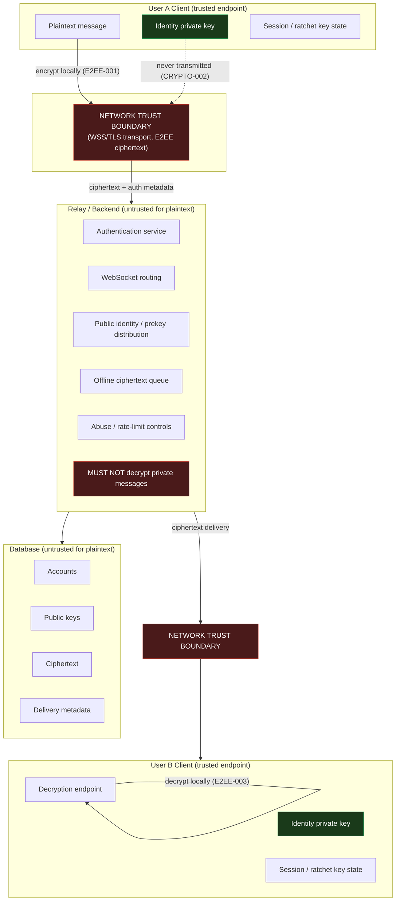
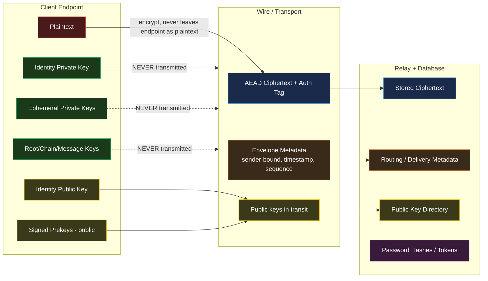
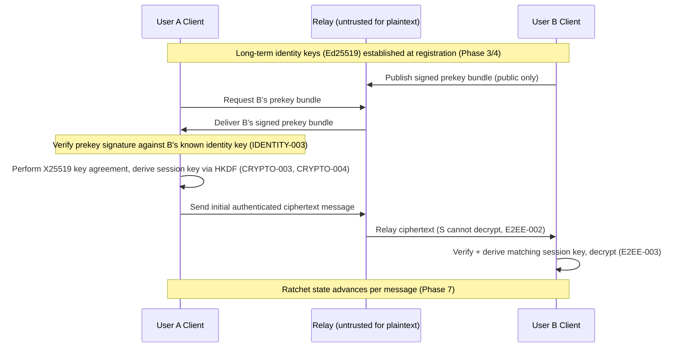
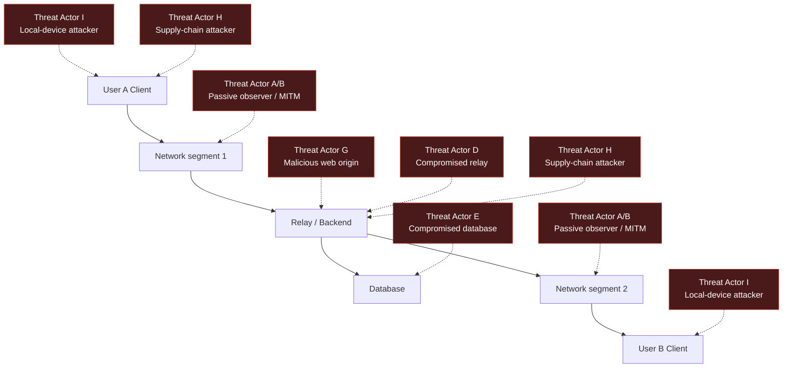

# Data Flow Diagram — Encrypted Chat Application

**Status:** Conceptual / Phase 0 documentation only. No implementation exists.
These diagrams describe the intended v1 architecture referenced by
[THREAT_MODEL.md](THREAT_MODEL.md) and [SECURITY_REQUIREMENTS.md](SECURITY_REQUIREMENTS.md).

---

## 1. System Data Flow with Trust Boundaries

**Legend:**
- Red boundary = untrusted network / relay trust boundary (ciphertext only crosses here).
- Green nodes = private key material that must never leave the endpoint.
- Dotted arrow = data flow that is explicitly forbidden (private key transmission).

---

## 2. Component / Data-Type Detail

**Legend:** red = plaintext (endpoint-only), green = private key material
(endpoint-only, never transmitted), blue = ciphertext, yellow = public key
material (safe to distribute), orange = metadata (unavoidably visible to relay,
see `THREAT_MODEL.md §13`), purple = authentication data at rest (hashed/derived,
never reversible plaintext).

---

## 3. Conceptual Authenticated Key-Agreement Flow (documentation only)

This sequence illustrates *what* must eventually be authenticated and *where*
trust is established — it is not an implementation and defines no wire format.
Actual design occurs in Phase 5.

---

## 4. Attacker Positions (overlay)

Threat actor letters correspond to `THREAT_MODEL.md §7`.

---

## 5. Notes

- These diagrams are Mermaid (text-based, version-controlled) as required by the
  master plan. A draw.io-compatible export was not produced in Phase 0 — the
  Mermaid source above is the authoritative, reviewable artifact; a draw.io
  export can be generated later if a specific reviewer requires it, without
  changing this document's authority.
- No diagram here should be read as describing an implemented system. They
  describe the target architecture that later phases must build toward and
  that Phase 12 must verify against.
